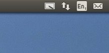
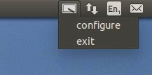

# PTXConf documentation

__P__en tablet and __T__ouch screen __X__input __Conf__iguration tool (__PTXConf__).
Configures touch/pen devices to work with extended desktops and multiple screens on Linux.

## Usage
To test ptxconf without installing it you can simply run the python executable directly from the source directory:
```sh
$ git clone http://github.com/wenhsinjen/ptxconf.git
$ cd ptxconf
$ ./ptxconf.py
```
NOTE: You may need to install the following dependencies first.
On Debian or Ubuntu based systems you can install the following packages before running PTXConf:
```sh
$ sudo apt-get install xinput x11-xserver-utils
$ sudo apt-get install python-gtk2 python-appindicator
```

After starting the application a tablet pen icon should sit in your system tray:




From the system tray you can then access the configuration dialog:


The dialog should show the configuration of your extended desktop as a set of monitors offset from each other. Here you can select the input pointer device and associate it directly with a particular monitor. The new mapping does not take effect until pressing the Apply button.

The dialog should handle all variations of monitor offsets, including
screen rotation. You should also be able to return to default whole desktop configuration by selecting the entire display rectangle.


NOTE: Currently ptxconf rotates the xinput axis to match the XWindows screen rotation. This is useful for those that have pen or touch screens, but may be less useful or even problematic for those that have pen or touch tablets. So please let us know if we should improve this.

## Installation
PTXConf depends on the python gtk2 and the AppIndicator binding. In the current POC state of this software we also depend on the xinput and xrandr command line tools. On debian based systems you can install these packages as follows,
```sh
$ sudo apt-get install xinput x11-xserver-utils
$ sudo apt-get install python-gtk2, python-appindicator
```
Then install this package,
```sh
$ git clone http://github.com/wenhsinjen/ptxconf.git
$ cd ptxconf
$ sudo python setup.py install
```
After this package has been submitted to PyPI you will be able to do,
```sh
$ sudo pip install ptxconf
```

## API code example

```python
from ptxconftools import ConfController
cc = ConfController()

# list pen/touch like pointing devices
for pt in cc.penTouchIds:
  print pt, cc.penTouchIds[pt]['id']

# list monitor layout
for mon in cc.monitorIds:
  print mon, cc.monitorIds[mon]

# map pointer device 'myPen' to monitor 'hdmi-1'
cc.setPT2Monitor('myPen','hdmi-1')
```
